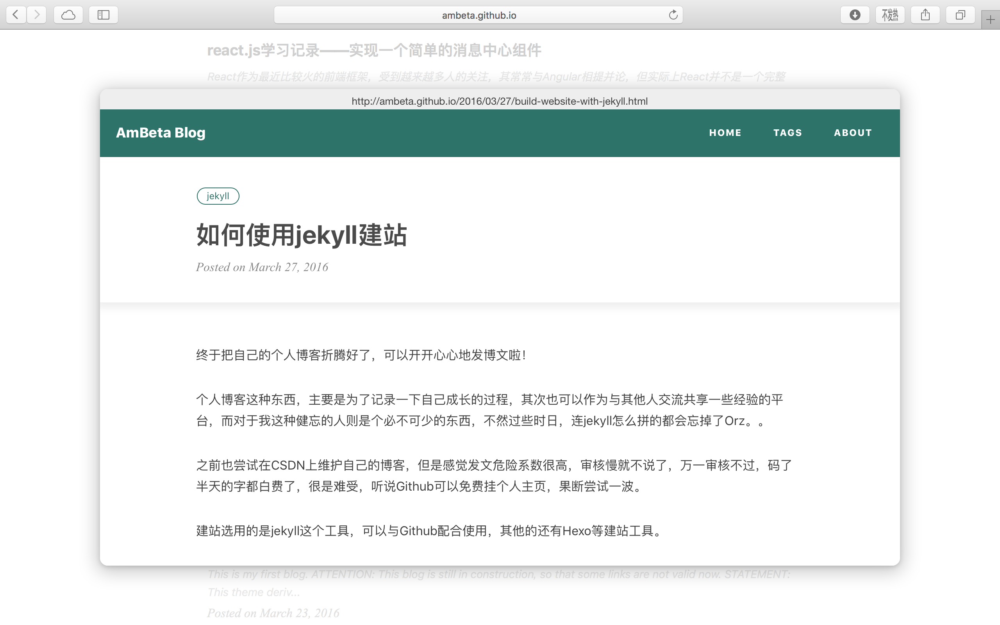

# LinkPeek

LinkPeek enables you to have a peek at the link in a page. You will love it when you visit a forum.

This idea mainly comes from the native feature in OS X 10.10, where you can click a link in Safari with three finger to have a peek at the target link.

## Index

* [Quick Start](#quick-start)
* [Options](#options)
* [Demo](#demo)
* [Compatability](#compatability)
* [License](#license)

## <a name="quick-start">Quick Start</a>

1. Include the files:  

    ```
    <script src="jquery.min.js"></script>
    <script src="jquery.linkpeek.js"></script>
    ```
    
2. Apply the plugin on a container:

    ```
    $('body').linkpeek();
    ```
    
3. Now click a link in the container with `ALT` key pressed down and have a peek!

## <a name="options">Options</a>

All available options are listed below:  

| Option | Type | Default | Description |
|:--------:|:------:|:---------:|-------------|
|selector|string|`'a'`|A CSS selector to select the target elements to apply LinkPeek on.|
|combineKey|string|`'alt'`|The key required to enable LinkPeek when mouse clicked down. Input an empty string to disable the key requirement.|
|autoHide|boolean|`true`|If `true`,automatically close the peek window when mouse leaves.|
|duration|Integer|`250`|The animation time for the peek window in microsecond(ms).|
|size|object|`{'width': '80%', 'height': '80%'}`|The peek window size by percentage of the window size of browser.|

## <a name="demo">Demo</a>



## <a name="compatability>Compatability</a>

* jQuery 1.7+ required
* browser with CSS3-enabled such as Chrome, Safari etc.

## <a name="license">License</a>

Licensed under the MIT License.